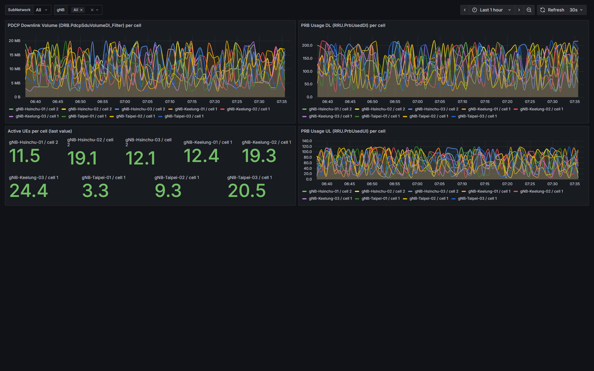
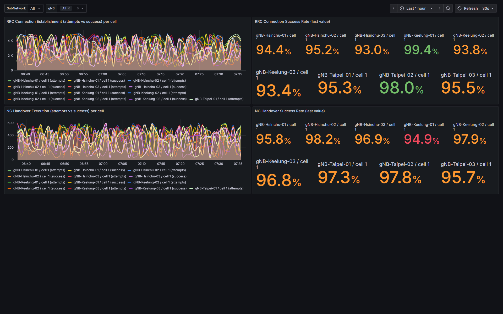

# o-ran-smo-ves-dashboards

[](CHANGELOG.md)
[](demo/docker-compose.yaml)
[](demo/docker-compose.yaml)
[](LICENSE)

Grafana dashboard pack for O-RAN SMO **perf3gpp PM counter data** stored in
InfluxDB via `nonrtric-plt-influxlogger`. Schema-validated end-to-end against
the real `nonrtric-plt-pmlog:1.1.0` image on 2026-04-19.

Two dashboards ship in v0.2.0: **NR cell DU** (PDCP volume, PRB usage,
active UEs) and **NR cell CU** (RRC connection establishment, NG handover
execution). No public Grafana dashboard targeting the
`nonrtric-plt-influxlogger` schema existed before this pack — the
Prometheus/KPM path is already well-served; the VES PM path was not.

## Preview





## Why this exists

Search results as of 2026-04-19:

- `grafana.com/grafana/dashboards/22297` — OAI 5G para: Prometheus path only.
- NIST `O-RAN-Testbed-Automation`, OpenRAN Gym, BubbleRAN — KPM xApp
  dashboards via Prometheus / VictoriaMetrics.
- Aarna AMCOP — commercial SMO dashboard (closed source).
- LFN 5G Super Blueprint — results dashboard still WIP.
- No public Grafana dashboard targeting the `nonrtric-plt-influxlogger`
  InfluxDB schema for VES domain events.

This pack fills that gap. Not the Prometheus/KPM gap — that's already served.

## Dashboard catalogue

| File | Domain | uid | Panels |
|---|---|---|---|
| `dashboards/measurement/ves-measurement-nrcell-du.json` | measurement | `ves-nrcell-du` | PDCP DL volume, PRB usage DL/UL, active UEs |
| `dashboards/measurement/ves-measurement-nrcell-cu.json` | measurement | `ves-nrcell-cu` | RRC conn establishment (attempts/success/rate), NG handover (attempts/success/rate) |

Each dashboard reads from measurements named with the full DN
(`SubNetwork=...,ManagedElement=...,NRCellDU=...`) with zero user tags and
counter-name fields — the exact schema `nonrtric-plt-influxlogger` writes.
See [`docs/schema-ground-truth-reference-2026-04-19-influxlogger-source.md`](docs/schema-ground-truth-reference-2026-04-19-influxlogger-source.md).

### Deliberately out of scope

Dashboards for fault / heartbeat / stndDefined event domains are **not**
included: `nonrtric-plt-influxlogger` only consumes perf3gpp PM data, so
those domains never reach the `pm_data` bucket. Visualising them belongs
to a different collector pipeline, tracked for a possible future
`ves-dmaap-dashboards` spin-off if demand appears.

## Local development layers

### Layer 0 -- offline, no network

```bash
# Verifies dashboard JSON schema compliance against Grafana's schema.
# (Added once we have dashboards to validate.)
```

### Layer 1 -- light local dev (docker-compose; no kind; no ranpm)

```bash
cd demo
docker compose up -d         # influxdb + dbrp-bootstrap + grafana
# open Grafana  http://localhost:3000 (admin / admin)
# open InfluxDB http://localhost:8086

# Seed fake VES events directly into InfluxDB using pytest-ves:
pip install -r ../scripts/requirements.txt
python ../scripts/seed-events.py --count 500 --rate 10
```

After the seeder finishes, open Grafana and browse the `VES` folder. The
`ves-nrcell-du` and `ves-nrcell-cu` dashboards should render data on their
panels.

This layer is good for iterating on dashboard visuals. The dashboard
queries match the `nonrtric-plt-influxlogger` schema end-to-end, validated
2026-04-19 via the `phase-1-work/minimal-probe` stack (Kafka -> pmlog ->
InfluxDB). See
`docs/schema-ground-truth-reference-2026-04-19-influxlogger-source.md`
for the canonical schema contract.

**Pointing these dashboards at a real influxlogger deployment** also
requires a v1 DBRP mapping on the `pm_data` bucket so InfluxDB 2.x can
serve the dashboards' InfluxQL queries. The local `demo/` stack
bootstraps this automatically; prod needs a one-time
`influx v1 dbrp create --db pm_data --rp autogen --bucket-id <id>
--default`. Details in the schema-ground-truth doc referenced above.

### Layer 2 -- kind + real nonrtric-plt-ranpm (heavy, for schema probing)

```bash
./kind/install-ranpm.sh            # kind cluster + full ranpm stack
./scripts/probe-schema.sh          # dump SHOW MEASUREMENTS / FIELDS / TAGS
```

The probe writes `docs/schema-ground-truth-<date>.md` summarising what
measurements, tags, and fields appear in InfluxDB after we send sample
VES events via pytest-ves.

## Sister project

[`pytest-ves`](https://github.com/thc1006/pytest-ves)
([PyPI](https://pypi.org/project/pytest-ves/), Apache-2.0) is used by
this repo's seeder and probe scripts to emit VES 7.2.1 events. Maintained
separately; both projects share the same schema ground-truth doc.

## Using on grafana.com

Pre-baked, portable versions of both dashboards live in
`dist/grafana-com/` — generated by `scripts/prepare-for-grafana-com.py`.
They have the provisioning-hardcoded datasource UID rewritten to
`${DS_INFLUXDB}` so grafana.com's "Upload a dashboard" form prompts the
importer for their own InfluxDB. If you maintain a fork and ship new
dashboards, re-run the script before uploading.

## Screenshots & regeneration

See [`scripts/capture-screenshots.md`](scripts/capture-screenshots.md)
for the 3-minute manual capture procedure (bring up demo stack, seed,
shoot, save). All screenshots referenced from this README live under
`docs/screenshots/`.

## License

Apache-2.0.
